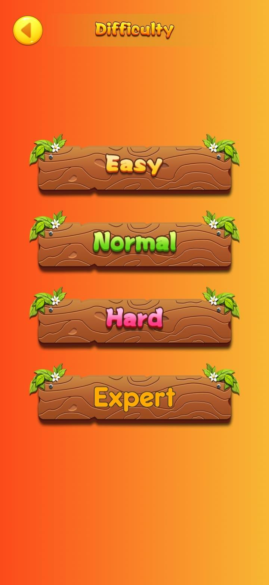
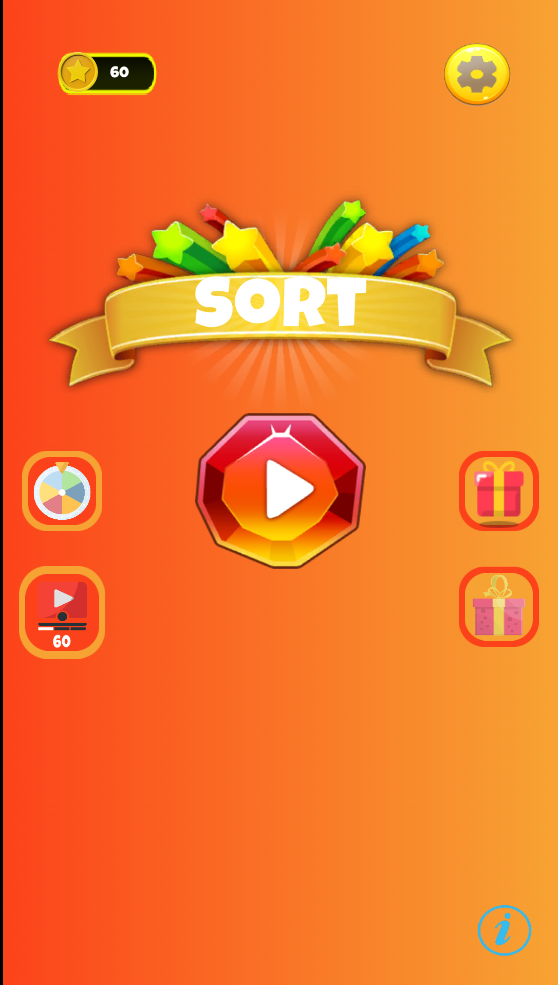
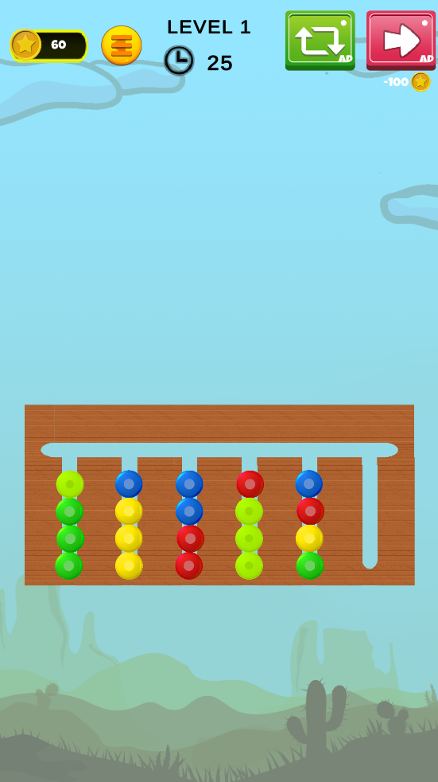

# Color-Button-Sort-Unity-2D
This is the game that was assigned to me as a Unity Game Developer Intern at AIRIDEV. 
The objective of the game is to sort the balls in the tubes according to the colors in the given time. The game has 4 difficulties which effect the time provided, number of tubes, number of colors to sort and initial arrangement.

## Screens

## App-Store
This game can be downloaded from [here](https://play.google.com/store/apps/details?id=com.ColorButtonSortPuzzle.CBSP&hl=de&pli=1).
